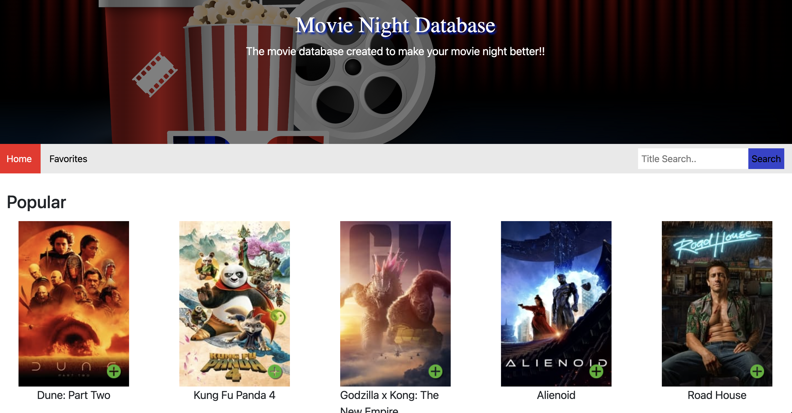
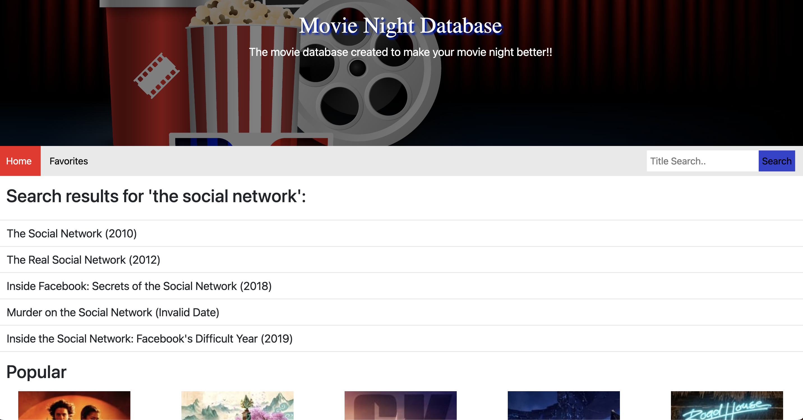
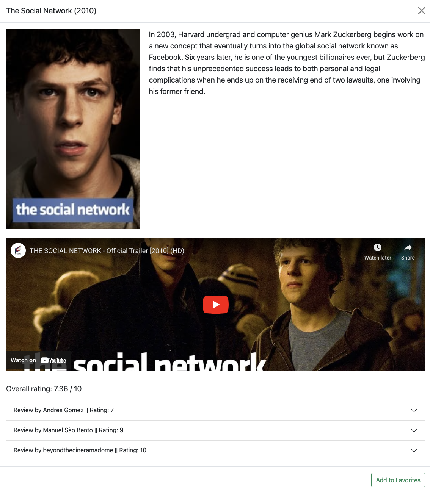
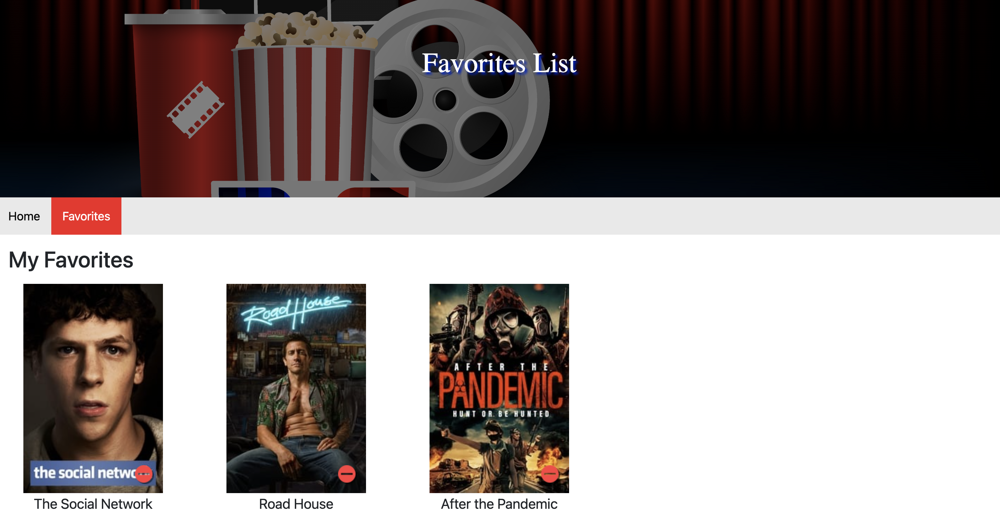

# Group-2-Project-1: Movie Night Database
## Description
This application is a movie database where users can search a movie title and view details on any movie. Additionally, they can add movies to a Favorites list, which can then be accessed on a separate page. 

## User Story
```
AS A passionate movie watcher

I WANT to see trending movie recommendations and search for movies

SO THAT I can choose the perfect movie for movie night
```

## Acceptance Criteria
```
GIVEN a movie database

WHEN I load the app

THEN I am presented with the landing page with a search bar and trending movies section of movie posters

WHEN I search a movie

THEN I'm given a list of results

WHEN I click on a result or a movie poster

THEN a modal pops up showing the movie information, trailer, and reviews

WHEN I click on the add button on the movie poster or the modal

THEN that movie title is added to my favorites

WHEN I click on the Favorites navigation link

THEN I am redirected to a page listing all the movies I added to my favorites
```

## Technologies Used
We used a combination of HTML, CSS/Bootstrap, JavaScript/jQuery, Day.js, and the TMDB & YouTube APIs to create this application.

## Deployed Application
The application has been deployed [here](https://blitzbomber87.github.io/Movie-Night-Database/).

The user will first see a search bar and a list of trending/popular movies.


When they search for a movie title, they will be given a list of results.


When they click on either a movie poster or search result, they are shown a modal of movie information.


After they add a movie to favorites, they can view their favorites list on a separate page.


### Citations
J.W. (2011). "How to check if the URL contains a given string?" JavaScript. https://stackoverflow.com/questions/4597050/how-to-check-if-the-url-contains-a-given-string. (script.js)